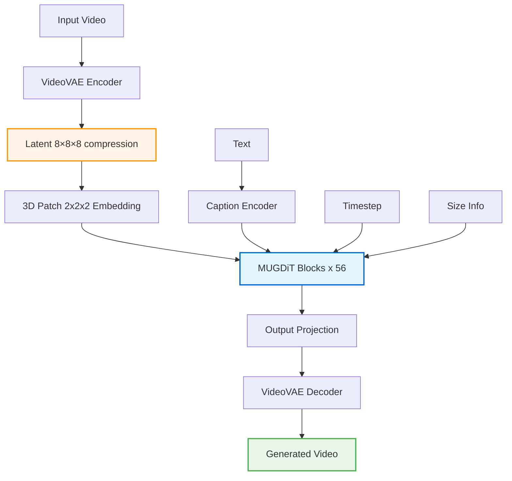

# MUG-V 10B: High-efficiency Training Pipeline for Large Video Generation Models

<div align="center">

**[Yongshun Zhang](yongshun.zhang@shopee.com)\* · [Zhongyi Fan](zhongyi.fan@shopee.com)\* · [Yonghang Zhang](yonghang.zhang@shopee.com) · [Zhangzikang Li](zhangzikang.li@shopee.com) · [Weifeng Chen](weifeng.chen@shopee.com)**

**[Zhongwei Feng](zhongwei.feng@shopee.com) · [Chaoyue Wang](daniel.wang@shopee.com)† · [Peng Hou](peng.hou@shopee.com)† · [Anxiang Zeng](zeng0118@e.ntu.edu.sg)†**

LLM Team, Shopee Pte. Ltd.

\* Equal contribution · † Corresponding authors

[](#)
[](https://huggingface.co/MUG-V/MUG-V-inference)
[](https://github.com/Shopee-MUG/MUG-V)
[](https://github.com/Shopee-MUG/MUG-V-Megatron-LM-Training)
[](LICENSE)

</div>


## Overview

**MUG-V 10B** is a large-scale video generation system built by the **Shopee Multimodal Understanding and Generation (MUG) team**. The core generator is a Diffusion Transformer (DiT) with ~10B parameters trained via flow-matching objectives. We release the complete stack:
- **Model weights**: Available in multiple formats on Hugging Face
  - **Inference**: [MUG-V-inference](https://huggingface.co/MUG-V/MUG-V-inference) - HuggingFace format
    - [MUGDiT-10B](https://huggingface.co/MUG-V/MUG-V-inference/blob/main/dit.pt) - Diffusion Transformer
    - [VideoVAE](https://huggingface.co/MUG-V/MUG-V-inference/blob/main/vae.pt) - 8×8×8 Video Autoencoder
  - **Training**: [MUG-V-training](https://huggingface.co/MUG-V/MUG-V-training) - Megatron format checkpoints
    - [Torch Distributed](https://huggingface.co/MUG-V/MUG-V-training/tree/main/MUG-V-10B-torch_dist) - Flexible TP/PP
    - [Torch format (legacy)](https://huggingface.co/MUG-V/MUG-V-training/tree/main/MUG-V-10B-TP4-legacy) - TP=4
- **[Inference code](https://github.com/Shopee-MUG/MUG-V)** for video generation and enhancement
- **[Training code](https://github.com/Shopee-MUG/MUG-V-Megatron-LM-Training)** (this repository) - Megatron-Core-based training framework
- **[Sample dataset](https://huggingface.co/datasets/MUG-V/MUG-V-Training-Samples)** for quick start and validation

This repository provides the core training framework implemented on top of [Megatron-LM](https://github.com/NVIDIA/Megatron-LM), addressing the core challenges in training billion-parameter video generation models.

### Why Megatron-Core for Video Generation?

This implementation is built on **Megatron-Core** to leverage its battle-tested distributed training infrastructure for maximum training efficiency. Notably, **the open-source community currently lacks a production-ready, out-of-the-box Megatron implementation for video diffusion model training**.

**Challenges**
- AdaLN modulation and global conditioning differ from standard LLM norms.
- Diffusion-style training (noise/velocity targets) vs. next-token prediction.
- Very long, variable sequences with text-conditioned cross-attention.

**Our Approach**
- No core changes: implement everything in `mcore_patch/` for easy upgrades.
- Native TP/PP/SP to handle long/variable video latents efficiently.
- DiT extensions: `MUGDiTLayer` with gated residuals + AdaLN, 3D RoPE, QK-Norm attention, and a rectified-flow training loop.

**Key Design Principles:**

- ✅ **Minimal intrusion**: We minimize modifications to Megatron-Core internals to ensure maintainability and easy upgrades
- ✅ **Extensibility through composition**: Custom video-specific components (3D RoPE, Modulation integration, etc.) are implemented as external modules in `mcore_patch/`
- ✅ **Reference implementation**: Serves as a practical example for training large-scale video generation models with Megatron-Core
- ✅ **Production-proven**: Successfully trained 10B-parameter models on 500 H100 GPUs with near-linear scaling
- ✅ **Continuously maintained**: Successfully rebased from Megatron-Core v0.9.0 → v0.11.0 → v0.14.0, demonstrating our design's compatibility with upstream evolution

This project demonstrates how to adapt Megatron-Core's infrastructure for video generation tasks while maintaining compatibility with upstream updates and providing a reusable template for the community.

---

## Table of Contents

- [Overview](#overview)
- [Key Features](#key-features)
- [Model Architecture](#model-architecture)
- [Installation](#installation)
- [Data Preparation](#data-preparation)
- [Quick Start](#quick-start)
  - [Option 1: From Scratch (Debug Model)](#option-1-quick-start-from-scratch-debug-model)
  - [Option 2: With Pre-trained Checkpoint (10B)](#option-2-quick-start-with-pre-trained-checkpoint-10b-model)
- [Checkpoint Conversion](#checkpoint-conversion)
  - [Download Pre-trained Models](#download-pre-trained-models)
- [Quality Metrics](#quality-metrics)
- [Related Repositories](#related-repositories)
- [Project Structure](#project-structure)
- [Citation](#citation)
- [License](#license)
- [Acknowledgements](#acknowledgements)
- [Roadmap](#roadmap)
  - [Model & Code Releases](#model--code-releases)
  - [Data & Documentation](#data--documentation)

---

## Key Features

### 🔧 Scalable Data Processing Pipeline
- High-quality video clip extraction and filtering from large corpora
- Fine-tuned VLM for structured, high-quality caption generation
- Stage-wise accuracy validation with high throughput

### 🎬 High-ratio VideoVAE Compression
- **8×8×8** compression along (time, height, width)
- Combined with **2×2** non-overlapping patchification → **~2048× compression**
- Reconstruction quality comparable to SOTA VAEs at this compression ratio
- Custom architecture and loss design for spatiotemporal modeling

### 🏗️ Training-stable Transformer Backbone
- **10 billion parameters** with stable training dynamics
- Novel image/frame conditioning scheme for cross-frame consistency
- Adaptive LayerNorm (AdaLN) modulation
- QK LayerNorm for attention stability

### 📈 Multi-stage Training Strategy
1. **Small-model validation**: Hyperparameter search on smaller models
2. **Curriculum pre-training**: Progressive difficulty scaling
3. **Annealed SFT**: Supervised fine-tuning with curated data
4. **Preference optimization**: Human-labeled preference learning

### ⚡ Efficient Training Infrastructure
- Built on **Megatron-Core** with data/tensor/pipeline parallelism
- Near-linear scaling on 500 H100 GPUs
- Hand-optimized Triton kernels
- Memory-efficient training without activation recomputation

---

## Model Architecture

MUGDiT adopts the latent diffusion transformer paradigm with rectified flow matching objectives:



#### Core Components

1. **VideoVAE**: 8×8×8 spatiotemporal compression
   - Encoder: 3D convolutions + temporal attention
   - Decoder: 3D transposed convolutions + temporal upsampling
   - KL regularization for stable latent space

2. **3D Patch Embedding**: Converts video latents to tokens
   - Patch size: 2×2×2 (non-overlapping)
   - Final compression: ~2048× vs. pixel space

3. **Position Encoding**: 3D Rotary Position Embeddings (RoPE)
   - Extends 2D RoPE to handle temporal dimension
   - Frequency-based encoding for spatiotemporal modeling

4. **Conditioning Modules**:
   - **Caption Embedder**: Projects text embeddings (4096-dim) for cross-attention
   - **Timestep Embedder**: Embeds diffusion timestep via sinusoidal encoding
   - **Size Embedder**: Handles variable resolution inputs

5. **MUGDiT Transformer Block**:

   ```mermaid
   graph LR
       A[Input] --> B[AdaLN]
       B --> C[Self-Attn<br/>QK-Norm]
       C --> D[Gate]
       D --> E1[+]
       A --> E1

       E1 --> F[LayerNorm]
       F --> G[Cross-Attn<br/>QK-Norm]
       G --> E2[+]
       E1 --> E2

       E2 --> I[AdaLN]
       I --> J[MLP]
       J --> K[Gate]
       K --> E3[+]
       E2 --> E3

       E3 --> L[Output]

       M[Timestep<br/>Size Info] -.-> B
       M -.-> I

       N[Text] -.-> G

       style C fill:#e3f2fd,stroke:#2196f3,stroke-width:2px
       style G fill:#f3e5f5,stroke:#9c27b0,stroke-width:2px
       style J fill:#fff3e0,stroke:#ff9800,stroke-width:2px
       style E1 fill:#c8e6c9,stroke:#4caf50,stroke-width:2px
       style E2 fill:#c8e6c9,stroke:#4caf50,stroke-width:2px
       style E3 fill:#c8e6c9,stroke:#4caf50,stroke-width:2px
   ```

6. **Rectified Flow Scheduler**:
   - More stable training than DDPM
   - Logit-normal timestep sampling
   - Linear interpolation between noise and data

---

## Installation

### Prerequisites

- Docker with NVIDIA Container Toolkit installed (`--gpus all` support)
- NVIDIA GPU (Ampere/Hopper recommended)
- Disk space to build the image (~20 GB)

### Build

Build from the repository root using the provided Dockerfile:

```bash
docker build -t mugv:latest -f examples/mugv/Dockerfile .
```

Base image: `nvcr.io/nvidia/pytorch:25.02-py3` (defined in the Dockerfile).

---

## Data Preparation

You can either download a sample dataset or prepare data with the simplified scripts in `data_preparation/`.

**NOTE on Data**: Due to copyright considerations, we will only release small sample datasets for demonstration purposes. For production training, you should prepare your own data following our documented format and using the provided preprocessing tools.

### Option A: Sample Dataset

We provide a small sample dataset on Hugging Face for quick start and validation:
- **Dataset**: [MUG-V/MUG-V-Training-Samples](https://huggingface.co/datasets/MUG-V/MUG-V-Training-Samples)
- **Training CSV**: [train.csv](https://huggingface.co/datasets/MUG-V/MUG-V-Training-Samples/blob/main/train.csv)

**Download Instructions:**

```bash
cd /path/to/data_root

# Install Hugging Face CLI (if not already installed)
pip install huggingface_hub

# Download the entire dataset
huggingface-cli download MUG-V/MUG-V-Training-Samples --repo-type dataset --local-dir sample_dataset

# Expected structure after download
# sample_dataset/
# ├── train.csv
# ├── latents/
# └── text_features/
```

Mount `.../sample_dataset` to `/data` inside the container (the training script looks for `/data/train.csv`).

### Option B: Prepare Your Own Data

**Environment Setup:**

```bash
uv venv --python 3.12 && source .venv/bin/activate
uv pip install -r examples/mugv/data_preparation/requirements.txt
```

This repo provides a streamlined data pipeline under `data_preparation/`. See [examples/mugv/data_preparation/README.md](examples/mugv/data_preparation/README.md) for detailed documentation.

**Prerequisites:**

Download the VideoVAE checkpoint for encoding videos:

```bash
# Download VideoVAE from Hugging Face
wget https://huggingface.co/MUG-V/MUG-V-inference/resolve/main/vae.pt -O /path/to/vae.pt

# Or using huggingface-cli
pip install huggingface_hub
huggingface-cli download MUG-V/MUG-V-inference vae.pt --local-dir ./models
```

**Quick workflow:**

1) **Extract text features** (T5-XXL 4096-dim)

```bash
python data_preparation/1_encode_text_features.py \
  --captions /path/to/captions.csv \
  --output-dir /path/to/text_features \
  --batch-size 32
```

2) **Encode videos** (using MUG VideoVAE)

```bash
python data_preparation/2_encode_video_latents.py \
  --video-dir /path/to/videos \
  --output-dir /path/to/latents \
  --vae-checkpoint /path/to/vae.pt \
  --fps 24
```

3) **Generate training CSV**

```bash
python data_preparation/3_generate_training_csv.py \
  --latents /path/to/latents \
  --text-features /path/to/text_features \
  --output /path/to/train.csv
```

4) **Verify dataset**

```bash
python data_preparation/4_verify_dataset.py \
  --csv /path/to/train.csv \
  --num-samples 10 \
  --verbose
```

**Directory Structure:**
```
data_root/
├── train.csv                    # Training metadata
├── latents/                     # VideoVAE latents
│   ├── video_001.pt             # Shape: [24, T, H, W]
│   ├── video_002.pt
│   └── ...
└── text_features/               # T5-XXL embeddings
    ├── video_001_text.pt        # Dict: {'y': [1, 1, L, 4096], 'mask': [1, L]}
    ├── video_002_text.pt
    └── ...
```

**CSV Format:**

```csv
sample_id,source,latent_path,text_feat_path
video_001,generated,latents/video_001.pt,text_features/video_001_text.pt
video_002,generated,latents/video_002.pt,text_features/video_002_text.pt
```

Column Descriptions:
- `sample_id`: Unique identifier (string)
- `source`: `generated` (skip normalization) or `real` (apply dataset mean/std)
- `latent_path`: Relative path to latent `.pt` from CSV directory
- `text_feat_path`: Relative path to text feature `.pt` from CSV directory

**Latent File Format (`.pt`):**
```python
# latents/video_001.pt
torch.Size([24, T, H, W])  # 24 channels, T frames, H×W resolution
# Example: [24, 30, 64, 64] for ~5s video at 720p (after 8×8×8 compression)
```

**Text Feature File Format (`.pt`):**
```python
# text_features/video_001_text.pt
{
    'y': torch.Tensor,      # Shape: [1, 1, seq_len, 4096], text embeddings
    'mask': torch.Tensor,   # Shape: [1, seq_len], attention mask
}
```

**Notes:**
- All scripts use models from `mug-v` (auto-installed via requirements.txt)
- If your text encoder hidden size is not 4096, pass `--caption-channels` accordingly when launching training
- For real VAE latents with known mean/std, set `source=real` in CSV (the loader will normalize latents)
- See [examples/mugv/data_preparation/README.md](examples/mugv/data_preparation/README.md) for complete documentation

## Quick Start

### Option 1: Quick Start from Scratch (Debug Model)

This quick start runs a small debug model with a small sample dataset to verify the environment, data wiring, and training loop. It is for validation only, not for quality benchmarking.

Prepare your dataset first as described above in Data Preparation, then run a single-GPU debug training.

```bash
# Point to your training CSV (prepared in Data Processing)
export DATA_TRAIN="/path/to/data_root/train.csv"

# Set a small debug model (or choose a larger variant)
export MODEL_TYPE="mugdit_debug"

# Local single-GPU launch vars
export MASTER_ADDR=127.0.0.1
export MASTER_PORT=34571
export WORLD_SIZE=1
export RANK=0

# Start training
bash examples/mugv/pretrain_notebook.sh
```

### Option 2: Quick Start with Pre-trained Checkpoint (10B Model)

To start training from a pre-trained MUG-V 10B checkpoint:

```bash
# 1. Download sample dataset
pip install huggingface_hub
huggingface-cli download MUG-V/MUG-V-Training-Samples --repo-type dataset --local-dir ./sample_dataset

# 2. Download pre-trained Megatron checkpoint (Torch Distributed format, recommended)
huggingface-cli download MUG-V/MUG-V-training --local-dir ./checkpoints --include "MUG-V-10B-torch_dist/*"

# 3. Set environment variables
export DATA_TRAIN="./sample_dataset/train.csv"
export MODEL_TYPE="mugdit_10b"
export CHECKPOINT_DIR="./checkpoints/MUG-V-10B-torch_dist/torch_dist"

# 4. Start fine-tuning (example for single node with 8 GPUs)
bash examples/mugv/pretrain_slurm.sh
```

**Notes:**
- The Torch Distributed checkpoint can be loaded with any TP/PP configuration
- For multi-node training, see the "Model Pre-Training" section below
- Modify `TP_SIZE` and `PP_SIZE` in the training script based on your GPU setup

---

### Model Pre-Training

We provide two training scripts:
- **`pretrain_slurm.sh`**: Auto-detects SLURM environment and configures distributed training (recommended)
- **`pretrain_torchrun.sh`**: Original script for custom setups

#### SLURM-based Training

The `pretrain_slurm.sh` script automatically detects your job scheduler (SLURM) and configures distributed training accordingly.

**Single-Node (8 GPUs):**

```bash
export MODEL_TYPE="mugdit_10b"
export DATA_TRAIN="/path/to/train.csv"
export TRAIN_ITERS=50000

# Direct execution (no scheduler)
bash examples/mugv/pretrain_slurm.sh

# Or via SLURM
sbatch --nodes=1 --gpus-per-node=8 examples/mugv/pretrain_slurm.sh
```

**Multi-Node (512 GPUs example):**

Create a SLURM batch script `submit_train.sh`:

```bash
#!/bin/bash
#SBATCH --job-name=mugdit-10b
#SBATCH --nodes=64
#SBATCH --ntasks-per-node=1
#SBATCH --gpus-per-node=8

export MODEL_TYPE="mugdit_10b"
export DATA_TRAIN="/path/to/train.csv"
export TRAIN_ITERS=50000
export TP_SIZE=4
export PP_SIZE=4

bash examples/mugv/pretrain_slurm.sh
```

Submit the job:
```bash
sbatch submit_train.sh
```

**Note on Job Schedulers:**

The script is an example implementation for SLURM. If you use a different job scheduler (Kubernetes, custom cluster manager, etc.), you can modify the environment detection logic in the script to work with your system's environment variables. The key is to set:
- `MASTER_ADDR`: Master node address
- `NNODES`: Total number of nodes
- `NODE_RANK`: Current node rank (0-indexed)
- `GPUS_PER_NODE`: Number of GPUs per node

**Note**: `pretrain_torchrun.sh` uses `--nproc_per_node 1` and expects `RANK` to be the global process rank. For easier multi-node training, use `pretrain_slurm.sh` instead.

---

#### Training Script Parameters Reference

The `pretrain_torchrun.sh` script can be configured via environment variables and internal settings:

**Environment Variables (Set before running):**

| Variable | Required | Default | Description |
|----------|----------|---------|-------------|
| `MODEL_TYPE` | Yes | - | Model variant: `mugdit_debug`, `mugdit_10b` |
| `DATA_TRAIN` | Yes | - | Path to training CSV file |
| `MASTER_ADDR` | Yes | - | Master node IP address for distributed training |
| `MASTER_PORT` | Yes | - | Master node port (e.g., 6000) |
| `WORLD_SIZE` | Yes | - | Total number of GPUs across all nodes |
| `RANK` | Yes | - | Node rank (0 for master, 1, 2, ... for workers) |

**Internal Configuration (Edit script to modify):**

<details>
<summary><b>Parallelism Settings</b></summary>

| Parameter | Default | Description |
|-----------|---------|-------------|
| `TP_SIZE` | 4 | Tensor parallelism degree (split layers across GPUs) |
| `PP_SIZE` | 4 | Pipeline parallelism degree (split depth across GPUs) |

**Note**: `WORLD_SIZE` must be divisible by `TP_SIZE × PP_SIZE × CP_SIZE`

</details>

<details>
<summary><b>Training Hyperparameters</b></summary>

| Parameter | Default | Description |
|-----------|---------|-------------|
| `TRAIN_ITERS` | 100000 | Total training iterations |
| `MICRO_BATCH_SIZE` | 1 | Per-GPU batch size |
| `GLOBAL_BATCH_SIZE` | Auto | Calculated as `WORLD_SIZE / TP_SIZE / PP_SIZE` |
| `SEQ_LEN` | 580000 | Max Sequence length in latent space |
| `lr` | 1e-5 | Learning rate |
| `min-lr` | 1e-5 | Minimum learning rate (for decay) |
| `lr-warmup-iters` | 100 | Warmup iterations |
| `lr-decay-iters` | 200 | Learning rate decay iterations |
| `lr-decay-style` | cosine | LR schedule: `cosine`, `linear`, `constant` |
| `weight-decay` | 0 | Weight decay coefficient |
| `clip-grad` | 1.0 | Gradient clipping threshold |
| `adam-beta1` | 0.9 | Adam optimizer beta1 |
| `adam-beta2` | 0.999 | Adam optimizer beta2 |
| `adam-eps` | 1e-10 | Adam optimizer epsilon |
| `seed` | 6309 | Random seed |

</details>

<details>
<summary><b>Model Architecture</b></summary>

| Parameter | Description |
|-----------|-------------|
| `--normalization RMSNorm` | Use RMSNorm instead of LayerNorm |
| `--qk-layernorm` | Apply LayerNorm to Q and K in attention |
| `--norm-epsilon 1e-6` | Epsilon for normalization layers |
| `--position-embedding-type rope` | Use Rotary Position Embeddings |
| `--rotary-percent 1.0` | Percentage of dimensions to apply RoPE |
| `--rotary-base 10000` | Base for RoPE frequencies |
| `--rotary-interleaved` | Use interleaved RoPE pattern |
| `--add-qkv-bias` | Add bias to QKV projections |
| `--transformer-impl transformer_engine` | Use Transformer Engine backend |

</details>

<details>
<summary><b>Optimization & Memory</b></summary>

| Parameter | Description |
|-----------|-------------|
| `--bf16` | Use BF16 mixed precision training |
| `--use-distributed-optimizer` | Distribute optimizer states across DP ranks (ZeRO-1) |
| `--overlap-param-gather` | Overlap parameter gathering with computation |
| `--overlap-grad-reduce` | Overlap gradient all-reduce with backward pass |
| `--recompute-method uniform` | Activation checkpointing method |
| `--recompute-granularity full` | Recompute full transformer layers |
| `--recompute-num-layers 1` | Recompute every N layers |
| `--use-flash-attn` | Use Flash Attention 2 |
| `--attention-softmax-in-fp32` | Compute softmax in FP32 for stability |
| `--manual-gc` | Enable manual garbage collection |
| `--async-save` | Asynchronous checkpoint saving |

</details>

<details>
<summary><b>Checkpointing & Logging</b></summary>

| Parameter | Default | Description |
|-----------|---------|-------------|
| `SAVE_INTERVAL` | 100 | Save checkpoint every N iterations |
| `EVAL_INTERVAL` | 100000 | Evaluate every N iterations |
| `--save` | `checkpoints/` | Checkpoint save directory |
| `--load` | `checkpoints/` | Checkpoint load directory |
| `--pretrained-checkpoint` | - | Path to pretrained checkpoint for fine-tuning |
| `--no-load-rng` | - | Don't load RNG states (for fine-tuning) |
| `--no-load-optim` | - | Don't load optimizer states (for fine-tuning) |
| `--log-interval` | 10 | Log training metrics every N iterations |
| `--tensorboard-dir` | `tensorboard/` | TensorBoard log directory |
| `--log-throughput` | - | Log training throughput (samples/sec) |
| `--log-params-norm` | - | Log parameter norms |
| `--log-num-zeros-in-grad` | - | Log gradient sparsity |

</details>

<details>
<summary><b>Data Loading</b></summary>

| Parameter | Default | Description |
|-----------|---------|-------------|
| `NUM_WORKERS` | 10 | Number of data loading workers per GPU |
| `--dataloader-save` | - | Save/restore dataloader state for resuming |

</details>

---

## Checkpoint Conversion

### Download Pre-trained Models

We provide both **inference-ready** (HuggingFace format) and **training-ready** (Megatron format) checkpoints:

#### Option A: Download Megatron Training Checkpoints (Recommended for Training)

Skip conversion steps and directly download Megatron-format checkpoints:

```bash
# Install Hugging Face CLI
pip install huggingface_hub

# Download Torch Distributed checkpoint (flexible TP/PP, recommended)
huggingface-cli download MUG-V/MUG-V-training --local-dir ./checkpoints --include "MUG-V-10B-torch_dist/*"

# Or download Torch format (legacy) checkpoint (TP=4 only)
huggingface-cli download MUG-V/MUG-V-training --local-dir ./checkpoints --include "MUG-V-10B-TP4-legacy/*"
```

**Available Training Checkpoints:**
- **[MUG-V-10B-torch_dist](https://huggingface.co/MUG-V/MUG-V-training/tree/main/MUG-V-10B-torch_dist)**: Torch Distributed format (flexible TP/PP, ~64GB)
  - Can be loaded with any TP/PP configuration
  - Recommended for production training
- **[MUG-V-10B-TP4-legacy](https://huggingface.co/MUG-V/MUG-V-training/tree/main/MUG-V-10B-TP4-legacy)**: Torch format (legacy) (TP=4 only, ~64GB)
  - Must be loaded with TP=4
  - Can be converted to Torch Distributed format

**Quick Start with Pre-converted Checkpoints:**

```bash
# After downloading, set the checkpoint path for training
export CHECKPOINT_DIR="./checkpoints/MUG-V-10B-torch_dist/torch_dist"
export MODEL_TYPE="mugdit_10b"
export DATA_TRAIN="/path/to/train.csv"

# Start training with pretrained checkpoint
# (See "Model Pre-Training" section for complete training commands)
bash examples/mugv/pretrain_slurm.sh
```

#### Option B: Download HuggingFace Format and Convert

Download inference-ready models and convert them to Megatron format:

```bash
# Download MUGDiT-10B model (HuggingFace format)
wget https://huggingface.co/MUG-V/MUG-V-inference/resolve/main/dit.pt -O /path/to/dit.pt

# Or using huggingface-cli (recommended for large files)
pip install huggingface_hub
huggingface-cli download MUG-V/MUG-V-inference dit.pt --local-dir ./models

# The downloaded model is in HuggingFace format, ready for conversion (see below)
```

**Available Inference Models:**
- **MUGDiT-10B**: [dit.pt](https://huggingface.co/MUG-V/MUG-V-inference/blob/main/dit.pt) - 10B parameter Diffusion Transformer (~20GB)
- **VideoVAE**: [vae.pt](https://huggingface.co/MUG-V/MUG-V-inference/blob/main/vae.pt) - 8×8×8 Video Autoencoder (~1GB)

---

### Overview: Checkpoint Format Types

This repository supports three checkpoint formats with different parallelism capabilities:

| Format | Megatron Name | Description | Parallelism Support | Use Case |
|--------|---------------|-------------|---------------------|----------|
| **HuggingFace** | N/A | Single-file or sharded `.pt` | None (single-device weights) | Inference, model sharing |
| **Torch format (legacy)** | `ckpt_format="torch"` | `mp_rank_XX/model_optim_rng.pt` | Fixed TP size at conversion time | Legacy compatibility |
| **Torch Distributed** | `ckpt_format="torch_dist"` | `.distcp` metadata files | Flexible TP/PP at load time | Production training (recommended) |

**Recommended workflow for training with multiple parallelism strategies:**

```
HuggingFace → Torch format (legacy) → Torch Distributed
```

The intermediate Torch format (legacy) step is necessary because:
1. Direct HF → Torch Distributed conversion is not yet implemented
2. For large models (10B+), single-GPU loading causes OOM
3. Torch format (legacy) can be loaded with TP=4, then converted to flexible Torch Distributed

---

### Step 1: HuggingFace → Torch format (legacy)

Convert HuggingFace checkpoint to Torch format (legacy) format with fixed Tensor Parallelism.

```bash
python -m examples.mugv.convertor.mugdit_hf2mcore \
    --hf-ckpt /path/to/huggingface/checkpoint \
    --output /path/to/torch_format_output \
    --tensor-parallel-size 4 \
    --use-te \
    --model-size 10B
```

**Arguments:**
- `--hf-ckpt`: Path to HuggingFace checkpoint (directory with shards or single `.pt` file)
- `--output`: Output directory for Torch format (legacy) checkpoint
- `--tensor-parallel-size`: Fixed TP size (choose 1 for small models, 4 for 10B to avoid OOM)
- `--use-te`: Enable Transformer Engine compatibility (adds `_extra_state` for FP8)
- `--model-size`: Model variant: `debug`, `10B`

**Output Structure (Torch format (legacy)):**
```
/path/to/torch_format_output/checkpoints/
├── iter_0000001/
│   ├── mp_rank_00/
│   │   └── model_optim_rng.pt
│   ├── mp_rank_01/
│   │   └── model_optim_rng.pt
│   ├── mp_rank_02/
│   │   └── model_optim_rng.pt
│   └── mp_rank_03/
│       └── model_optim_rng.pt
└── latest_checkpointed_iteration.txt
```

**Notes:**
- Supports both sharded HF checkpoints (with `pytorch_model.bin.index.json`) and single `.pt` files
- Weights are chunked across TP ranks at conversion time (fixed parallelism)
- If `y_embedder.y_embedding` is missing, loads from `fixtures/y_embedding.pt`
- ⚠️ This checkpoint can **only** be loaded with the same TP size specified during conversion

---

### Step 2: Torch format (legacy) → Torch Distributed (Recommended)

Convert Torch format (legacy) checkpoint to Torch Distributed Checkpoint for flexible parallelism.

#### TP=4 (For 10B models to avoid OOM)

```bash
bash examples/mugv/convertor/torch2dist_tp4.sh
```

Edit the script to configure:
```bash
export CHECKPOINT_DIR="/path/to/torch_format_output/checkpoints"
export CKPT_SAVE_DIR="/path/to/torch_dist_output"
export MODEL_TYPE="mugdit_10b"
```

**What this scripts do:**
1. Load Torch format (legacy) checkpoint via `--pretrained-checkpoint` with matching TP size
2. Initialize model and optimizer
4. Save as Torch Distributed format with `--ckpt-convert-format torch_dist`
5. Output: Flexible Torch Distributed checkpoint usable with **any TP/PP configuration**

**Output Structure (Torch Distributed):**
```
/path/to/torch_dist_output/
├── iter_0000001/
│   ├── __0_0.distcp          # Distributed checkpoint shard 0
│   ├── __1_0.distcp          # Distributed checkpoint shard 1
│   ├── ...
│   ├── common.pt             # Shared metadata
│   └── metadata.json         # Checkpoint metadata
└── latest_checkpointed_iteration.txt
```

**Key Advantage:**
- ✅ Can be loaded with **any TP/P settings** at training time
- ✅ No need to re-convert when experimenting with different parallelism strategies
- ✅ Production-ready format used by Megatron-Core training

---

### Megatron → HuggingFace (Export for Inference)

Convert Megatron checkpoint back to HuggingFace format for inference or model sharing.

#### From Torch Distributed

```bash
python -m examples.mugv.convertor.mugdit_mcore2hf \
    --dcp-dir /path/to/checkpoints/iter_0050000 \
    --output /path/to/hf_model.pt \
    --model-size 10B
```

#### From Torch format (legacy)

```bash
python -m examples.mugv.convertor.mugdit_mcore2hf \
    --mcore-state /path/to/torch_format_output/checkpoints/iter_0000001 \
    --output /path/to/hf_model.pt \
    --model-size 10B
```

**Arguments:**
- `--dcp-dir`: Path to Torch Distributed checkpoint directory (e.g., `checkpoints/iter_0050000`)
- `--mcore-state`: Path to Torch format (legacy) checkpoint directory (alternative to `--dcp-dir`)
- `--output`: Output HuggingFace `.pt` file path (default: `/tmp/hf_ckpt.pt`)
- `--model-size`: Model variant: `debug`, `10B`
- `--ref-hf-ckpt`: (Optional) Reference HF checkpoint for precision verification (allclose with atol=1e-4)

**Notes:**
- Exactly one of `--dcp-dir` or `--mcore-state` must be provided
- Automatically merges TP-sharded weights back to single tensors
- Removes optimizer states, `_extra_state`, and RNG states
- Output is a single `.pt` file loadable by `mug-v`

---

### Complete Conversion Workflow Examples

#### Example 1: HuggingFace → Flexible Training Checkpoint

```bash
# Step 1: HF → Torch format (legacy) (TP=4 to avoid OOM for 10B)
python -m examples.mugv.convertor.mugdit_hf2mcore \
    --hf-ckpt /data/mugdit_10b_hf \
    --output /data/torch_format_tp4 \
    --tensor-parallel-size 4 \
    --use-te \
    --model-size 10B

# Step 2: Torch format (legacy) → Torch Distributed (flexible parallelism)
# Edit torch2dist_tp4.sh:
#   CHECKPOINT_DIR="/data/torch_format_tp4/checkpoints"
#   CKPT_SAVE_DIR="/data/mugdit_10b_torch_dist"
bash examples/mugv/convertor/torch2dist_tp4.sh

# Result: /data/mugdit_10b_torch_dist/iter_0000001/*.distcp
# This can now be loaded with any TP/PP configuration!
```

#### Example 2: Export Trained Model to HuggingFace

```bash
# After training, convert Torch Distributed checkpoint to HF for inference
python -m examples.mugv.convertor.mugdit_mcore2hf \
    --dcp-dir /workspace/checkpoints/iter_0100000 \
    --output /data/mugdit_10b_trained.pt \
    --model-size 10B

# Use with MUG-V
# See: https://github.com/Shopee-MUG/MUG-V
# cp /data/mugdit_10b_trained.pt /path/to/MUG-V/checkpoints/
```

---

### Quick Reference

| Task | Command | Output Format |
|------|---------|---------------|
| HF → Torch format (TP=4) | `python -m examples.mugv.convertor.mugdit_hf2mcore --hf-ckpt ... --output ... --tensor-parallel-size 4 --use-te --model-size 10B` | Torch format (legacy) (fixed TP) |
| Torch format → Torch Distributed (TP=1) | `bash examples/mugv/convertor/torch2dist_tp1.sh` | Torch Distributed (flexible) |
| Torch format → Torch Distributed (TP=4) | `bash examples/mugv/convertor/torch2dist_tp4.sh` | Torch Distributed (flexible) |
| Torch Distributed → HF | `python -m examples.mugv.convertor.mugdit_mcore2hf --dcp-dir ... --output model.pt --model-size 10B` | HuggingFace |
| Torch format → HF | `python -m examples.mugv.convertor.mugdit_mcore2hf --mcore-state ... --output model.pt --model-size 10B` | HuggingFace |

---

## Quality Metrics

### VBench-I2V Leaderboard Evaluation

MUG-V 10B ranks **3rd on the VBench-I2V leaderboard** at submission time, demonstrating competitive performance compared to leading video generation models including both open-source and commercial systems.

**VBench-I2V Quantitative Comparison:**

| Model | Size | VTCM | VISC | VIBC | SC | BC | MS | DD | AQ | IQ | I2V Score | Quality Score | Total Score |
|-------|------|------|------|------|----|----|----|----|----|----|-----------|---------------|-------------|
| CogVideoX | 5B | 67.68 | 97.19 | 96.74 | 94.34 | 96.42 | 98.40 | 33.17 | 61.87 | 70.01 | 94.79 | 78.61 | 86.70 |
| STIV | 8.7B | 11.17 | **98.96** | 97.35 | **98.40** | 98.39 | **99.61** | 15.28 | **66.00** | **70.81** | 93.48 | 79.98 | 86.73 |
| Step-Video | 30B | 49.23 | 97.86 | 98.63 | 96.02 | 97.06 | 99.24 | 48.78 | 62.29 | 70.44 | 95.50 | 81.22 | 88.36 |
| Dynamic-I2V | 5B | **88.10** | 98.83 | 98.97 | 96.21 | 98.39 | 98.88 | 27.15 | 60.10 | 69.23 | **98.12** | 78.78 | 88.45 |
| HunyuanVideo | 13B | 49.91 | 98.53 | 97.37 | 95.26 | 96.70 | 99.23 | 22.20 | 62.55 | 70.14 | 95.10 | 78.54 | 86.82 |
| Wan2.1 | 14B | 34.76 | 96.95 | 96.44 | 94.86 | 97.07 | 97.90 | 51.38 | 64.75 | 70.44 | 92.90 | 80.82 | 86.86 |
| MAGI-1 | 24B | 50.85 | 98.39 | 99.00 | 93.96 | 96.74 | 98.68 | **68.21** | 64.74 | 69.71 | 96.12 | **82.44** | **89.28** |
| **MUG-V** | **10B** | **23.17** | **98.82** | **99.51** | **95.73** | **98.52** | **98.90** | **57.24** | **61.37** | **68.48** | **95.37** | **81.55** | **88.46** |

**Metric Abbreviations:**
- **VTCM**: Video-Text Camera Motion - Measures alignment between generated camera motion and text descriptions
- **VISC**: Video-Image Subject Consistency - Evaluates consistency of subject appearance between input image and generated video
- **VIBC**: Video-Image Background Consistency - Evaluates consistency of background between input image and generated video
- **SC**: Subject Consistency - Temporal consistency of subject appearance across frames
- **BC**: Background Consistency - Temporal consistency of background across frames
- **MS**: Motion Smoothness - Measures smoothness of motion trajectories
- **DD**: Dynamic Degree - Measures the amount of motion in generated videos
- **AQ**: Aesthetic Quality - Perceptual aesthetic assessment
- **IQ**: Imaging Quality - Overall visual quality and fidelity
- **I2V Score**: Image-to-Video specific metrics weighted score
- **Quality Score**: Overall quality metrics weighted score
- **Total Score**: Final VBench score (weighted combination of all metrics)

*Note: VBench evaluation strictly follows the [VBench-I2V protocol](https://github.com/Vchitect/VBench). Results are from the official VBench-I2V leaderboard at submission time. The complete leaderboard is available at [VBench Leaderboard](https://huggingface.co/spaces/Vchitect/VBench_Leaderboard).*

---

### Human Evaluation on E-commerce Video Generation

MUG-V 10B demonstrates **superior performance on e-commerce video generation tasks** through human evaluation, significantly outperforming competing models on domain-specific quality metrics.

**E-commerce Task Performance (Text-Image to Video):**

| Model | Pass Rate | High-Quality Rate |
|-------|-----------|-------------------|
| **MUG-V-TI2V** | **29.00%** | **2.80%** |
| Wan2.1-TI2V | 24.40% | 2.00% |
| Hunyuan-TI2V | 14.29% | 0.80% |

**Evaluation Metrics:**
- **Pass Rate**: Percentage of generated videos that meet minimum quality standards for e-commerce use (acceptable for publication)
- **High-Quality Rate**: Percentage of generated videos rated as high-quality by professional e-commerce content reviewers (ready for direct use without editing)

**Key Findings:**
- 🏆 **2× better pass rate** than HunyuanVideo (29.00% vs. 14.29%)
- 🏆 **19% improvement** over Wan2.1 (29.00% vs. 24.40%)
- 🏆 **3.5× higher high-quality rate** than HunyuanVideo (2.80% vs. 0.80%)
- 🎯 **Domain specialization**: Optimized for e-commerce scenarios including product showcases, lifestyle scenes, and model displays
- 👥 **Professional evaluation**: Assessed by experienced e-commerce content creators and marketing professionals

This evaluation demonstrates MUG-V's effectiveness for **production e-commerce applications**, where both generation success rate and output quality directly impact business value.

---

## Related Repositories

- **[MUG-V](https://github.com/Shopee-MUG/MUG-V)**: Inference code for video generation and enhancement
- **[MUG-V-Megatron-LM-Training](https://github.com/Shopee-MUG/MUG-V-Megatron-LM-Training)**: This repository - Megatron-Core training framework
- **[MUG-V-inference (Hugging Face)](https://huggingface.co/MUG-V/MUG-V-inference)**: Inference-ready model weights
  - [MUGDiT-10B (dit.pt)](https://huggingface.co/MUG-V/MUG-V-inference/blob/main/dit.pt) - HuggingFace format
  - [VideoVAE (vae.pt)](https://huggingface.co/MUG-V/MUG-V-inference/blob/main/vae.pt) - 8×8×8 Video Autoencoder
- **[MUG-V-training (Hugging Face)](https://huggingface.co/MUG-V/MUG-V-training)**: Training-ready Megatron checkpoints
  - [MUG-V-10B-torch_dist](https://huggingface.co/MUG-V/MUG-V-training/tree/main/MUG-V-10B-torch_dist) - Torch Distributed format (flexible TP/PP)
  - [MUG-V-10B-TP4-legacy](https://huggingface.co/MUG-V/MUG-V-training/tree/main/MUG-V-10B-TP4-legacy) - Torch format (TP=4)
- **[MUG-V-Training-Samples (Hugging Face)](https://huggingface.co/datasets/MUG-V/MUG-V-Training-Samples)**: Sample training dataset

---

## Project Structure

```
examples/mugv/
├── Dockerfile                     # Build image (NGC 25.02); CMD runs pretrain_notebook.sh
├── README.md                      # This file
├── requirements.txt               # Example dependencies
├── requirements-nodeps.txt        # Extra packages installed without deps (optional)
├── __init__.py
│
├── Training
├── pretrain_notebook.sh           # Single-node debug runner (1 GPU)
├── pretrain_torchrun.sh           # Multi-node/torchrun launcher
├── train_mugdit.py                # Training entry (Megatron-Core)
├── dataloader_dummy_provider.py   # Dataloader provider wrapping LatentDataset
├── rectified_flow.py              # Rectified flow scheduler
├── model_flops_utilization.py     # MFU logging helpers
│
├── Core Model
├── mugdit.py                      # Top-level MUGDiT model
├── mugdit_block.py                # Block stack, recompute, PP integration
├── mugdit_layer.py                # Per-layer logic (SA, Cross-Attn, MLP, gates)
├── mugdit_embed.py                # PatchEmbed3D, Timestep/Size/Caption embedders, output head
├── mugdit_modulate.py             # AdaLN (ModulateLayerNorm) + ScaleShiftTable
├── mugdit_patchify.py             # 3D patchify/unpatchify ops
├── mugdit_spec.py                 # Layer specs (TE/local), QK-Norm wiring
├── mugdit_tracker.py              # Loss tracking & metrics
├── config.py                      # Model config/constants
├── random_utils.py                # Misc helpers
│
├── Megatron-Core Patches
├── mcore_patch/
│   ├── attention.py               # SelfAttention + CrossAttentionQKNorm
│   ├── transformer_layer.py       # Base layer with hooks/ordering fixes
│   ├── rotary_pos_embedding_3d.py # 3D RoPE implementation
│   └── fusions/
│       ├── fused_bias_dropout.py
│       └── fused_bias_dropout_gate.py
│
├── Data Pipeline
├── data_module/
│   ├── __init__.py
│   ├── dataloader.py                 # DDP-aware dataloader wrapper
│   ├── datasets.py                   # LatentDataset (VideoVAE latents + text)
│   ├── read_video.py                 # Video I/O utilities
│   ├── video_transforms.py           # Augmentations
│   ├── sampler.py                    # Distributed sampler
│   └── utils.py                      # Data utilities
│
├── Data Preparation (Streamlined)
├── data_preparation/
│   ├── README.md                     # Complete data preparation guide
│   ├── QUICKSTART.md                 # Quick reference guide
│   ├── requirements.txt              # Data prep dependencies
│   ├── 1_encode_text_features.py     # T5-XXL text feature extractor (uses mug-v)
│   ├── 2_encode_video_latents.py     # VideoVAE encoder (uses mug-v)
│   └── 3_generate_training_csv.py    # Create train.csv with validation
│
├── Checkpoint Conversion
└── convertor/
    ├── mugdit_hf2mcore.py            # HF → Megatron converter
    ├── mugdit_mcore2hf.py            # Megatron → HF converter
    ├── mugdit_mcore2hf_legacy.py     # Torch format (legacy) converter
    ├── torch2dist_tp1.sh             # Convert single-rank ckpt → distributed (TP=1)
    ├── torch2dist_tp4.sh             # Convert single-rank ckpt → distributed (TP=4)
    └── ema_restore.py                # EMA weight restoration (Python)
```

---

## Citation
If you find our work useful in your research, please consider citing:

```bibtex
@article{zhang2025mugv10b,
  title={MUG-V 10B: High-efficiency Training Pipeline for Large Video Generation Models},
  author={Zhang, Yongshun and Fan, Zhongyi and Zhang, Yonghang and Li, Zhangzikang and Chen, Weifeng and Feng, Zhongwei and Wang, Chaoyue and Hou, Peng and Zeng, Anxiang},
  journal={arXiv preprint},
  year={2025}
}
```

---

## License

This project is licensed under the Apache License 2.0 - see the [LICENSE](LICENSE) file for details.

---

## Acknowledgements

We would like to thank the contributors to the [Open-Sora](https://github.com/hpcaitech/Open-Sora), [DeepFloyd/t5-v1_1-xxl](https://huggingface.co/DeepFloyd/t5-v1_1-xxl), [Wan-Video](https://github.com/Wan-Video), [Qwen](https://huggingface.co/Qwen), [HuggingFace](https://huggingface.co), [Megatron-LM](https://github.com/NVIDIA/Megatron-LM), and [NVIDIA NeMo](https://github.com/NVIDIA/NeMo) repositories, for their open research.

**Note on AI Collaboration**: The training code and model implementation in this repository were written entirely by human developers without AI assistance. This documentation (README.md) was created with the collaboration of AI tools (ChatGPT) to improve clarity and organization.

---

## Roadmap

### Model & Code Releases
- [X] Pre-training framework
- [X] Release pre-trained MUGDiT-10B checkpoints
- [X] Data preprocessing tools (video encoding, text encoding)
- [ ] Custom Triton Kernels Integration

### Data & Documentation
- [X] Sample dataset for quick start (~2000 samples)
- [X] Detailed data preparation guide

---

**Note**: This codebase is derived from our internal large-scale production training framework. Due to data compliance requirements and internal sensitivity, some proprietary tools and platform-specific parameters have been removed. As a result, the codebase may contain some redundant code or missing dependencies. If you encounter any issues related to these modifications, please feel free to open an issue.
